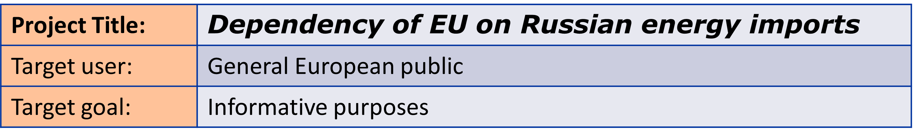
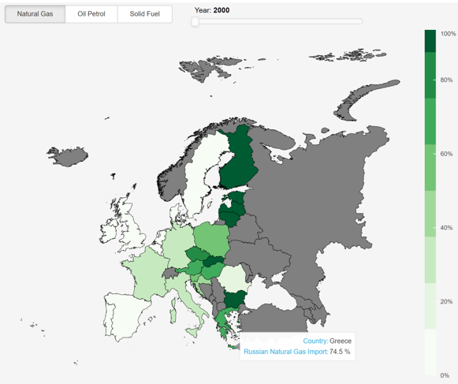

# Dependency of EU on Russian energy imports
## Information Visualization Project

The following project presents a visualization dashboard developed in python that makes use of interactive visualization libraries such as Bokeh and Panel to ilustrate the dependency of the European Union on energy imports from Russia.

Energy security is one of the most important elements in assuring the basic needs of a country, such as its stability, and economic development. This has been put in question in recent years and especially in the last few months with the shift in the geopolitical situation with regards to Russia. This visualization tool thus proposes to bring the information on the energy imports from Russia relative to the total import. This information is to be presented with a help of a choropleth map, a treemap, and a line graph with various interactivity levels.

 
The main target user for the visualization is the general public primarily located in EU countries.This mainly includes the adult citizens and residents that are allowed to vote in these countries. However, this tool can also be used as a quick reference tool for governmental bodies or politicians.

## Datasets and Sources:
***Main Source: [Eurostat][1]***

We have used four main datasets with actual data on energy imports and energy dependency, and one additional dataset with countries’ polygons for the purposes of drawing a map in our visualization.

Besides the shapefile dataset of EU countries that was taken from the European Environmental Agency, all datasets were obtained from Eurostat. Eurostat is the main statistical office of the European Union which is interconnected with the EU’s national statistical offices via the European Statistical System (ESS). Eurostat provides high-quality data collection in a consistent and normative way that is bound by legislation for all member countries. This assures a reliable source for the purposes of the visualization for this project.

[1]: https://ec.europa.eu/eurostat "Eurostat"

Energy Import Datasets:
* Imports of natural gas by partner country
* Imports of solid fossil fuels by partner country
* Imports of oil and petroleum products by partner country

Energy Imports Dependency

Shapefile with border lines (geometry) of the European countries.

##	Components of the visualization
###	Choropleth Map

Choropleth maps are thematic maps that allow visualizing variables to change across geographic areas. It uses different shades, patterns, and sequential color palettes for geographic areas based on statistical data. Data is categorized with light colors or shades to represent lower numerical data values and darker areas represent higher values (as the color bar indicates). The data was prepared to display the values as in percentages from the three main datasets after performing the preprocessing step (Natural Gas, Oil Petrol, and Solid Fuel datasets).

It was the best approach to represent the imports share of the European Union from Russia on a map as it provides users with a visual geographical reference that in other graphical formats would be rather hard to convey. The non-EU countries were colored with a gray color representing the NaN values and each dataset uses a different color palette (greens, blues, and oranges).

Also, users can hover over a particular country to see detailed information:

 
### Treemap

After some feedback, the use of a pie chart to represent the ratio difference between the share of a specific country for energy resources was highly discouraged. So, it was decided to display categorical data in hierarchical visualization. The selected component was a treemap because it allows showing the composition of a whole for many components using the space efficiently. It also allows to display the absolute import divided it into smaller parts for every exporter country; in this sense, hierarchical data is nested into blocks (rectangles). Each category (continent) is given a main rectangular box that then is divided into smaller rectangles representing sub-branches. A leaf node's rectangle has an area proportional to a specified dimension of data (import from a specific exporter country to the selected country in the EU).

 

### Timeline graph

As a way to visualize values of imports and the trend over the years for specific countries, a timeline graph that has all the information of the selected dataset and selected country from 2000 until 2020 was implemented, this highlighted area under the curve matches the selected year. The default value is the European Union but once a country is clicked in the choropleth map, the information of that country is then displayed in the timeline graph.

 
###	Other Components
A table displaying the relative and absolute values of energy import for the selected dataset, year and country is provided as a direct feedback for the users. The units change according to the data set and the value according to the selected country.

## Control elements
1.	Radio buttons

Three radio buttons were used to give the user the ability to select between 3 different datasets (Natural Gas, Oil Petrol, and Solid Fuel).

2.	Slider

A slider ranging from 2000 to 2020 was implemented to be able to select a specific year of the import data from which the user is interested. The year 2020 was chosen as the default because it represents the most recent available year of the dataset.

## Interactivity
1. 	Selecting a Country: Clicking on the map

To select a country on the dashboard, the user must directly click on the country on the map, resulting in highlighting such a country and darkening all other parts of the map. To return to the standard visualization the user just needs to click on the sea.

 

2. Selecting Dataset and Year: Via Radio buttons and Year slider -> effect on which graphs

All the components in the upper left side of the dashboard affect the graphs, the radio buttons change the dataset represented on the plots and change the color palette of the choropleth map and time plot (while keeping the color palette consistent on these two).

   

To let users identify the main focus areas and avoid detracting them with too many colors on different graphs, we proposed only applying matching colors on the choropleth map and the timeline graph. In this sense, the treemap graph makes only use of the gray palette (independent of the selected dataset). The default visualization of the treemap displays all the regions in the world so to have a general idea about the share of imports worldwide, this data changes also according to the specific dataset and year.

However, if a country is selected, the treemap will display just the partner countries that contribute to the import.

The plotline palette of colors follows the same interactivity as the choropleth map, with a specific color according to the data set. There is a highlighted area under the curve that changes according to the selected year on the selector and just a single label displaying the selected country.  

# Instructions to debug

Instructions:

1. Make sure to use an environment with python 3.9.11

You can easily do so by installing Anaconda:
	https://docs.anaconda.com/anaconda/install/windows/
Then you can open a terminal and create the environment via:
	conda create -n py39 python=3.9
	conda activate py39
Feel free to use Visual Code or Pycharm to edit the python file.

Note: If you have python recently installed it is most likely to be 3.9,
if so you can skip the previous step and use your environment on visual code or pycharm

2. Requirements: Install the following dependencies:
+ pandas:
pip install pandas
+ plotly:
pip install plotly
+ plotly express:
pip install plotly_express==0.4.0
+ panel
pip install panel
+ bokeh
pip install bokeh
+ matplotlib
pip install matplotlib
+ geopandas: to be installed correctly, install as follows:
pip install wheel
pip install pipwin
pipwin install numpy
pipwin install pandas
pipwin install shapely
pipwin install gdal
pipwin install fiona
pipwin install pyproj
pipwin install six
pipwin install rtree
pipwin install geopandas
+ descartes: for plotting geopandas
pip install descartes

Note: 	You can do by typing in the terminal: pip install pandas (for example)
	Maybe you are required to install something else, if so the
	console will tell you what and you just need to do pip install...

3. From the terminal you can mount the bokeh server using the following command:
bokeh serve --show main.py

4. At this point a new tab in your browser is created with the dashboard created in the python file.